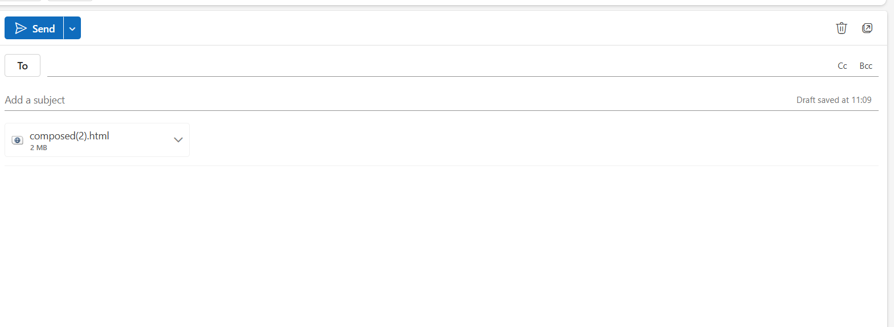
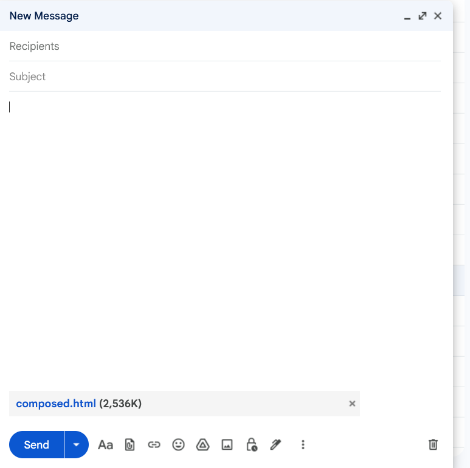

# Payload Composer

A client-side HTML payload composer for red team operations and security research. Embeds arbitrary binary files into self-contained HTML pages that trigger downloads via blob URLs — no server required.

## Features

- **4 Preset Templates** — Simple, Corporate Portal, Invoice, Software Installer
- **Custom Templates** — Upload or paste your own HTML with marker placeholders
- **3 Download Modes** — Auto (timer-triggered), Button (click-only), Both (auto + fallback button)
- **Obfuscation Layers** — Sliced base64, randomized element IDs, hidden SVG containers
- **Live Preview** — Iframe preview of generated output with source view and build log
- **Zero Dependencies** — Pure vanilla JS, no build step, no server, runs entirely in-browser

## Bypass Results

| Outlook | Gmail |
|---------|-------|
|  |  |
| ✅ Not detected | ✅ Not detected |

## Quick Start

```bash
git clone https://github.com/yt2w/html-payload-smuggler.git
cd payload-composer
# Open index.html in any modern browser — that's it
```

Or serve locally:
```bash
python3 -m http.server 8080
# → http://localhost:8080
```

## Usage

1. **Select a template** (preset or custom HTML)
2. **Drop a payload file** (any binary — .exe, .dll, .iso, .pdf, etc.)
3. **Configure download mode** — Auto, Button, or Both
4. **Click Compose** (or `Ctrl+Enter`)
5. **Download the composed HTML** or copy the source

The output is a single self-contained `.html` file. When opened by a target, it reconstructs the payload from embedded base64 slices and triggers a download via `createObjectURL`.

## Template Markers

Use these placeholders in custom HTML templates:

| Marker | Replaced With |
|--------|---------------|
| `{{DOWNLOAD_TRIGGER}}` | Download button element |
| `{{COUNTDOWN}}` | Countdown timer span |
| `{{SPINNER}}` | Loading spinner div |
| `{{PAYLOAD_NAME}}` | Configured output filename |

## Project Structure

```
├── index.html          Main application page
├── css/
│   └── style.css       Dark theme styles
├── js/
│   └── app.js          Application logic (composer engine)
└── README.md
```

## Configuration Options

| Option | Default | Description |
|--------|---------|-------------|
| Output filename | `document.iso` | What the downloaded file is named |
| Download mode | Auto | Auto / Button / Both |
| Auto-trigger delay | 2.5s | Seconds before auto-download fires |
| Countdown duration | 300s | Visible countdown timer (0 = disabled) |
| Slice size | 80 chars | Base64 chunk size per array element |
| Random ID length | 9 | Length of randomized element IDs |

## Technical Details

- Payload is base64-encoded and split into an array of string slices
- At runtime, slices are joined, decoded via `atob()`, and served as a Blob download
- Element IDs are randomized per composition to avoid signature matching
- No external requests — everything is inline in the output HTML
- Works offline after initial page load

## Keyboard Shortcuts

| Shortcut | Action |
|----------|--------|
| `Ctrl+Enter` | Compose (when payload loaded) |

## Browser Support

Chrome 80+, Firefox 78+, Safari 14+, Edge 80+

## Disclaimer

This tool is intended for authorized security testing, red team engagements, and educational purposes only. Misuse of this tool for unauthorized access or malicious purposes is illegal and unethical. Always obtain proper authorization before conducting security assessments.

## License

MIT
